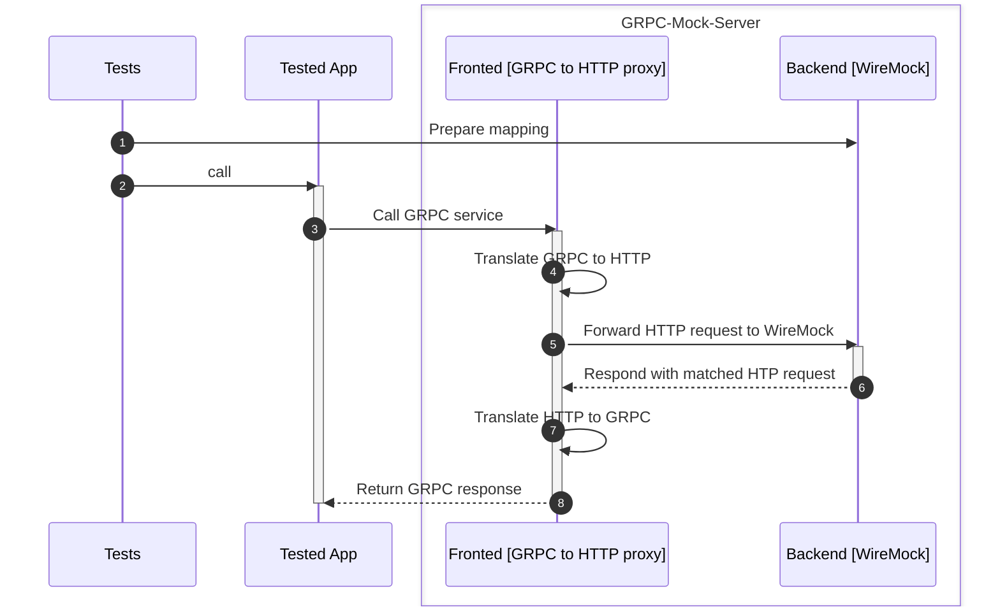
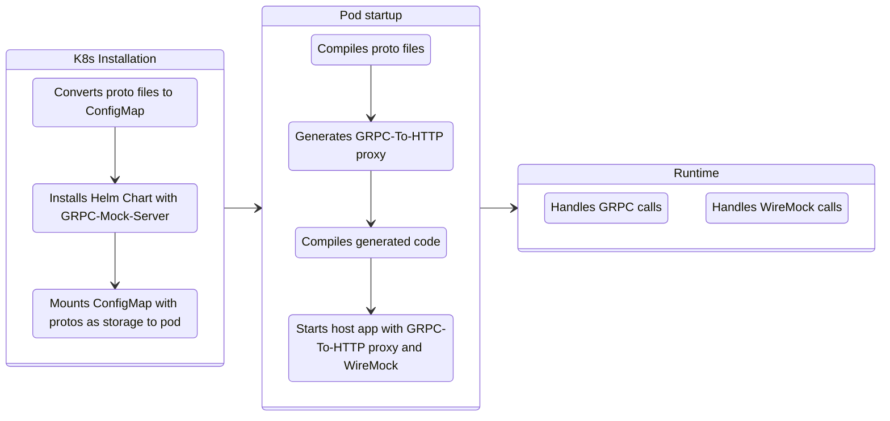

# GRPC-Mock-Server
Super fast, platform independent, standalone component for mocking GRPC services using [WireMock.NET](https://github.com/WireMock-Net/WireMock.Net) stubbing engine

## How does it work

GRPC-Mock-Server works in the following way:
- compile provided `*.proto` files
- generate proxy for every service and method defined in the `*.proto` files
- use the generated proxy to translate GRPC calls to REST and forward it to `WireMock` backend




## How to run GRPC-Mock-Server

### Option 1: Running docker container manually

```
docker run -it -p 5033:5033 -p 9095:9095 -v $(pwd)/protos:/protos cezarypiatek/grpc-mock-server
```

Ports:
- 5033 for GRPC
- 9095 for Stubbing (WireMock API)

### Option 2: Using TestContainerGrpcMockServerConnector

`TestContainerGrpcMockServerConnector` uses [Testcontainers for .NET](https://dotnet.testcontainers.org/) to spin docker container directly from the C# code. This options requires docker service running locally.

```cs
await using var connector = new TestContainerGrpcMockServerConnector(protoDirectory: "protos", grpcPort:5033);

await connector.Install();
```

### Option 3: Using TestChartGrpcMockServerConnector

`TestChartGrpcMockServerConnector` uses [SmoothSailing](https://github.com/cezarypiatek/SmoothSailing) to deploy GRPC-Mock-Server into Kubernetes cluster directly from the C# code. This option requires `Helm` and `kubectl` to installed on the host machine.



```cs
await using var connector = new TestChartGrpcMockServerConnector(protoDirectory: "protos", grpcPort:5033);

await connector.Install();
```

[](https://www.nuget.org/packages/GrpcTestKit/)

All C# components required for `Option 2` and `Option 3` are provided by [GrpcTestKit nuget package](https://www.nuget.org/packages/GrpcTestKit/) .

```
dotnet add package GrpcTestKit
```

### Option 4: Using source generator + proto files

1. Add the following nuget package references

```xml
<ItemGroup>
    <PackageReference Include="Grpc.AspNetCore" Version="2.53.0" />
    <PackageReference Include="WireMock.Net" Version="1.5.25" />
    <PackageReference Include="GrpcTestKit" Version="1.18.0" />
</ItemGroup>
```

2. Include your proto files
```xml
<ItemGroup>
    <Protobuf Include="protos\**\*.proto" ProtoRoot="protos" GrpcServices="Server" />
</ItemGroup>
```

3. Define partial class for your mock server

```cs
[GrpcMockServerForAutoDiscoveredSourceServices]
public partial class MyInMemoryGrpcMockServer
{
}
```

3. Use geneated mock server type

```cs
await using var mockServer = new MyInMemoryGrpcMockServer(grpcPort: 5033, wireMockPort: 9096);
var connectionInfo = await mockServer.Install();
```

### Option 5: Using source generator + GRPC server stub

1. Add the following nuget package references

```xml
<ItemGroup>
    <PackageReference Include="Grpc.AspNetCore" Version="2.53.0" />
    <PackageReference Include="WireMock.Net" Version="1.5.25" />
    <PackageReference Include="GrpcTestKit" Version="1.18.0" />
</ItemGroup>
```

2. Define partial class for your mock server

```cs
[GrpcMockServerFor(typeof(Sample.SampleBase))]
public partial class MyInMemoryGrpcMockServer
{
}
```

3. Use geneated mock server type

```cs
await using var mockServer = new MyInMemoryGrpcMockServer(grpcPort: 5033, wireMockPort: 9096);
var connectionInfo = await mockServer.Install();
```

## How to prepare mocks

```cs
await using var connector = new TestContainerGrpcMockServerConnector( protoDirectory: "protos", grpcPort:5033);

await connector.Install();

var grpcMockClient = connector.CreateClient();

await grpcMockClient.MockRequestReply
(
    serviceName: "my.package.Sample",
    methodName: "TestRequestReply",
    request: new { name = "Hello 1" },
    response: new { message = "Hi there 1" }
);

await grpcMockClient.MockRequestReply
(
    serviceName: "my.package.Sample",
    methodName: "TestRequestReply",
    request: new { name = "Hello 2" },
    response: new { message = "Hi there 2" }
);

await grpcMockClient.MockServerStreaming
(
    serviceName: "my.package.Sample",
    methodName: "TestServerStreaming",
    request: new { name = "Hello streaming" },
    response: new[]
    {
        new {message = "Hi there 1"},
        new {message = "Hi there 2"},
        new {message = "Hi there 3"}
    }
);

await grpcMockClient.MockClientStreaming
(
    serviceName: "my.package.Sample",
    methodName: "TestServerStreaming",
    requests: new []
    {
        new { name = "Hello streaming 1" },
        new { name = "Hello streaming 2" }
    },
    response: new { message = "Hi there streaming client" }
);
```

You can also generate stub helpers that will simplify your code responsible for preparing mocks/stubs.


```cs
[GrpcMockHelperFor(typeof(Sample.SampleBase))]
public partial class SampleMockHelper
{

}
```

Now you can prepare your mocks as follows:

```cs
await using var connector = new InMemoryGrpcMockServerConnector(grpcPort:5033, wireMockPort: 9594);
                
_ = await connector.Install();

var grpcMockClient = connector.CreateClient();

var mockHelper = new SampleMockHelper(grpcMockClient);

_ = await mockHelper.MockTestRequestReply
(
    request: new HelloRequest {Name = "Hello 1"},
    response: new HelloReply {Message = "Hi there 1"}
);

_ = await mockHelper.MockTestServerStreaming
(
    request: new HelloRequest {Name = "Hello streaming"},
    response: new[]
    {
        new HelloReply {Message = "Hi there 1"},
        new HelloReply {Message = "Hi there 2"},
        new HelloReply {Message = "Hi there 2"},
    }
);

_ = await mockHelper.MockTestClientStreaming
(
    request: new []
    {
        new HelloRequest {Name = "Hello streaming 1"},
        new HelloRequest {Name = "Hello streaming 2"},
    },
    response: new HelloReply
    {
        Message = "Hi there streaming client"
    }
);

```


## Supported GRPC communication patterns

|Pattern|Implementation status|
|---|----|
|request-reply|✅|
|server-streaming|✅|
|client-streaming|✅|
|duplex-streaming|❌|


## TODO
- [ ] Implement error response codes
- [x] Stub generator
- [x] Publish source generator as nuget package to allow for hosting GRPC-Mock-Server in-process
- [x] Implement library that wraps WireMock API for stubbing
- [x] Implement test container

## Alternatives
- https://github.com/Adven27/grpc-wiremock
- https://github.com/tokopedia/gripmock
