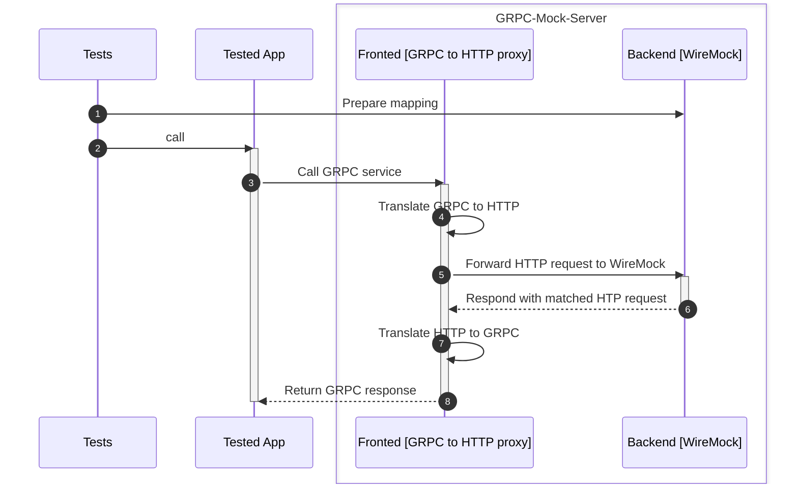
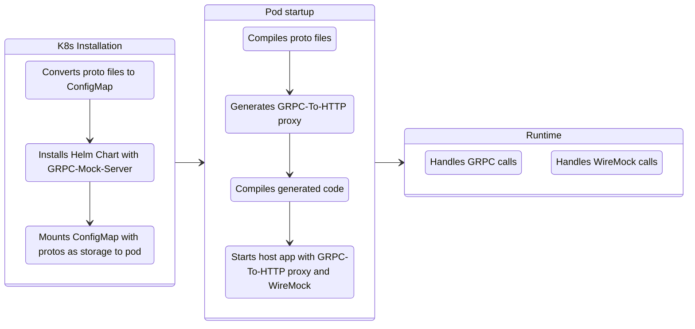

# GRPC-Mock-Server
Super fast, platform independent, standalone component for mocking GRPC services using [WireMock.NET](https://github.com/WireMock-Net/WireMock.Net) stubbing engine

## Supported GRPC communication patterns

|Pattern|Implementation status|
|---|----|
|request-reply|✅|
|server-streaming|✅|
|client-streaming|✅|
|duplex-streaming|✅|

## How does it work

GRPC-Mock-Server works in the following way:
- compile provided `*.proto` files
- generate proxy for every service and method defined in the `*.proto` files
- use the generated proxy to translate GRPC calls to REST and forward it to `WireMock` backend




## How to run GRPC-Mock-Server

### Option 1: Running docker container manually

```
docker run -it -p 5033:5033 -p 9095:9095 -v $(pwd)/protos:/protos cezarypiatek/grpc-mock-server
```

Ports:
- 5033 for GRPC
- 9095 for Stubbing (WireMock API)

### Option 2: Using TestContainerGrpcMockServerConnector

`TestContainerGrpcMockServerConnector` uses [Testcontainers for .NET](https://dotnet.testcontainers.org/) to spin docker container directly from the C# code. This options requires docker service running locally.

```cs
await using var connector = new TestContainerGrpcMockServerConnector(protoDirectory: "protos", grpcPort:5033);

await connector.Install();
```

### Option 3: Using TestChartGrpcMockServerConnector

`TestChartGrpcMockServerConnector` uses [SmoothSailing](https://github.com/cezarypiatek/SmoothSailing) to deploy GRPC-Mock-Server into Kubernetes cluster directly from the C# code. This option requires `Helm` and `kubectl` to be installed on the host machine.



```cs
var settings = new TestChartGrpcMockServerConnectorSettings
{
    ProtoDirectory = "protos",
    GrpcPort = 8889,
    ExposeStubbingPortOnLocalhost = true
};
await using var connector = new TestChartGrpcMockServerConnector(settings);

var connectionInfo = await connector.Install();
```

[](https://www.nuget.org/packages/GrpcTestKit/)

All C# components required for `Option 2` and `Option 3` are provided by [GrpcTestKit nuget package](https://www.nuget.org/packages/GrpcTestKit/) .

```
dotnet add package GrpcTestKit
```

### Option 4: Using source generator + proto files

1. Add the following nuget package references

```xml
<ItemGroup>
    <PackageReference Include="Grpc.AspNetCore" Version="2.53.0" />
    <PackageReference Include="WireMock.Net" Version="1.5.25" />
    <PackageReference Include="GrpcTestKit" Version="1.18.0" />
</ItemGroup>
```

2. Include your proto files
```xml
<ItemGroup>
    <Protobuf Include="protos\**\*.proto" ProtoRoot="protos" GrpcServices="Server" />
</ItemGroup>
```

3. Define partial class for your mock server

```cs
[GrpcMockServerForAutoDiscoveredSourceServices]
public partial class MyInMemoryGrpcMockServer
{
}
```

3. Use geneated mock server type

```cs
await using var mockServer = new MyInMemoryGrpcMockServer(grpcPort: 5033, wireMockPort: 9096);
var connectionInfo = await mockServer.Install();
```

### Option 5: Using source generator + GRPC server stub

1. Add the following nuget package references

```xml
<ItemGroup>
    <PackageReference Include="Grpc.AspNetCore" Version="2.53.0" />
    <PackageReference Include="WireMock.Net" Version="1.5.25" />
    <PackageReference Include="GrpcTestKit" Version="1.18.0" />
</ItemGroup>
```

2. Define partial class for your mock server

```cs
[GrpcMockServerFor(typeof(Sample.SampleBase))]
public partial class MyInMemoryGrpcMockServer
{
}
```

3. Use geneated mock server type

```cs
await using var mockServer = new MyInMemoryGrpcMockServer(grpcPort: 5033, wireMockPort: 9096);
var connectionInfo = await mockServer.Install();
```

## How to prepare mocks

```cs
await using var connector = new TestContainerGrpcMockServerConnector( protoDirectory: "protos", grpcPort:5033);

await connector.Install();

var grpcMockClient = connector.CreateClient();

await grpcMockClient.MockRequestReply
(
    serviceName: "my.package.Sample",
    methodName: "TestRequestReply",
    request: new { name = "Hello 1" },
    response: new { message = "Hi there 1" }
);

await grpcMockClient.MockRequestReply
(
    serviceName: "my.package.Sample",
    methodName: "TestRequestReply",
    request: new { name = "Hello 2" },
    response: new { message = "Hi there 2" }
);

await grpcMockClient.MockServerStreaming
(
    serviceName: "my.package.Sample",
    methodName: "TestServerStreaming",
    request: new { name = "Hello streaming" },
    response: new[]
    {
        new {message = "Hi there 1"},
        new {message = "Hi there 2"},
        new {message = "Hi there 3"}
    }
);

await grpcMockClient.MockClientStreaming
(
    serviceName: "my.package.Sample",
    methodName: "TestServerStreaming",
    requests: new []
    {
        new { name = "Hello streaming 1" },
        new { name = "Hello streaming 2" }
    },
    response: new { message = "Hi there streaming client" }
);

await grpcMockClient.MockDuplexStreaming
(
    serviceName: "my.package.Sample",
    methodName: "TestClientServerStreaming", 
    scenario: new MessageExchange[]
    {
        new ()
        {
            Requests = new[]
            {
                new {name = "Ping 1a"},
                new {name = "Ping 1b"}
            },
            Responses = new[]
            {
                new {message = "Pong 1"}
            }
        },
        new ()
        {
            Requests = new[]
            {
                new {name = "Ping 2"},
            },
            Responses = new[]
            {
                new {message = "Pong 2a"},
                new {message = "Pong 2b"}
            }
        },
});
```

You can also generate stub helpers that will simplify your code responsible for preparing mocks/stubs.


```cs
[GrpcMockHelperFor(typeof(Sample.SampleBase))]
public partial class SampleMockHelper
{

}
```

Now you can prepare your mocks as follows:

```cs
await using var connector = new InMemoryGrpcMockServerConnector(grpcPort:5033, wireMockPort: 9594);
                
_ = await connector.Install();

var grpcMockClient = connector.CreateClient();

var mockHelper = new SampleMockHelper(grpcMockClient);

_ = await mockHelper.MockTestRequestReply
(
    request: new HelloRequest {Name = "Hello 1"},
    response: new HelloReply {Message = "Hi there 1"}
);

_ = await mockHelper.MockTestServerStreaming
(
    request: new HelloRequest {Name = "Hello streaming"},
    response: new[]
    {
        new HelloReply {Message = "Hi there 1"},
        new HelloReply {Message = "Hi there 2"},
        new HelloReply {Message = "Hi there 2"},
    }
);

_ = await mockHelper.MockTestClientStreaming
(
    request: new []
    {
        new HelloRequest {Name = "Hello streaming 1"},
        new HelloRequest {Name = "Hello streaming 2"},
    },
    response: new HelloReply
    {
        Message = "Hi there streaming client"
    }
);

_ = await mockHelper.MockTestClientServerStreaming(new MessageExchange<HelloRequest, HelloReply>[]
{
    new()
    {
        Requests = new HelloRequest[]
        {
            new() {Name = "Ping 1a"},
            new() {Name = "Ping 1b"}
        },
        Responses = new HelloReply[]
        {
            new() {Message = "Pong 1"}
        }
    },
    new()
    {
        Requests = new HelloRequest[]
        {
            new() {Name = "Ping 2"},
        },
        Responses = new HelloReply[]
        {
            new() {Message = "Pong 2a"},
            new() {Message = "Pong 2b"}
        }
    },
});
```

## Activity Scope Limiting (Trace ID Filtering)

GRPC-Mock-Server supports automatic filtering of mock responses based on the trace ID from the current `Activity`. This feature is particularly useful in parallel test execution scenarios where multiple tests are running concurrently and you want to ensure that each test only receives responses from its own mocks.

### Prerequisites

**Important:** To use this feature, you must create an `Activity` for the scope of each test method. This ensures that each test has its own unique trace ID.

```cs
using System.Diagnostics;

[Fact]
public async Task MyTest()
{
    using var activity = new Activity("MyTest").Start();
    
    // Setup mocks and run test code here
    // All mocks created within this activity scope will be isolated to this test
}
```

Without creating an activity, `System.Diagnostics.Activity.Current` will be `null`, and the activity scope limiting feature will not work.

### How it works

When `activityScopeLimit` is enabled (which is the default), the mock server automatically adds a `traceparent` header matcher to the stub configuration. This matcher uses the trace ID from `System.Diagnostics.Activity.Current` to ensure that only requests originating from the same activity context will match the stub.

The trace ID is extracted from the current activity and added as a wildcard matcher pattern:
```
traceparent: *{currentActivity.TraceId}*
```

This means that only GRPC calls made within the same activity scope (with the same trace ID) will match the configured mock response.

### Controlling the feature

All mock methods support the `activityScopeLimit` parameter with a default value of `true`:

```cs
// Using the GrpcMockClient directly
await grpcMockClient.MockRequestReply
(
    serviceName: "my.package.Sample",
    methodName: "TestRequestReply",
    request: new { name = "Hello" },
    response: new { message = "Hi there" },
    activityScopeLimit: true  // Default value, can be omitted
);

// Disabling activity scope limiting
await grpcMockClient.MockRequestReply
(
    serviceName: "my.package.Sample",
    methodName: "TestRequestReply",
    request: new { name = "Hello" },
    response: new { message = "Hi there" },
    activityScopeLimit: false  // Mock will respond to all requests regardless of trace ID
);
```

### Using with generated stub helpers

Generated stub helpers also support the `activityScopeLimit` parameter:

```cs
var mockHelper = new SampleMockHelper(grpcMockClient);

// With activity scope limiting (default)
await mockHelper.MockTestRequestReply
(
    request: new HelloRequest { Name = "Hello" },
    response: new HelloReply { Message = "Hi there" }
    // activityScopeLimit defaults to true
);

// Without activity scope limiting
await mockHelper.MockTestRequestReply
(
    request: new HelloRequest { Name = "Hello" },
    response: new HelloReply { Message = "Hi there" },
    activityScopeLimit: false
);
```

### Supported methods

The `activityScopeLimit` parameter is available for all communication patterns:
- `MockRequestReply`
- `MockServerStreaming`
- `MockClientStreaming`
- `MockDuplexStreaming`

### When to disable activity scope limiting

You might want to disable activity scope limiting (`activityScopeLimit: false`) in the following scenarios:
- When running tests sequentially (not in parallel)
- When you want a mock to respond to all requests regardless of their origin
- When the tested application doesn't propagate trace IDs in GRPC calls
- When you need to share mocks across different activity contexts

## TODO
- [ ] Implement error response codes
- [x] Stub generator
- [x] Publish source generator as nuget package to allow for hosting GRPC-Mock-Server in-process
- [x] Implement library that wraps WireMock API for stubbing
- [x] Implement test container

## Alternatives
- https://github.com/Adven27/grpc-wiremock
- https://github.com/tokopedia/gripmock
